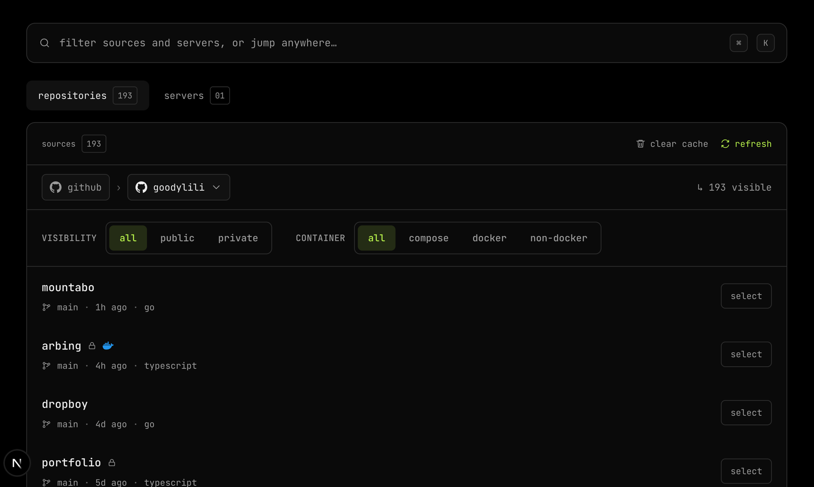
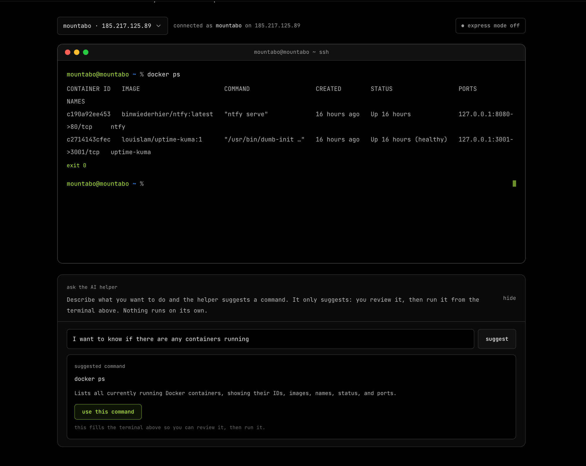

# Mountabo

Mountabo helps you deploy your app to your own server.

You run it locally, connect GitHub, add a VPS, and configure a repo once. After that, pushes to your chosen branch deploy through GitHub Actions straight to your server.

## Showcase



Mountabo deploys any repository with a `Dockerfile` or a Docker Compose setup, whatever the stack. Pick one in the picker, choose a server, and deploy.

## What You Need

- Go
- Node.js and npm
- a Linux VPS you can SSH into as `root`
- a repo with either a `Dockerfile` or a Docker Compose setup

If you want custom domains:

- DNS pointing at your server
- ports `80` and `443` open

## Setup

### 1. Install dependencies

```bash
make deps
```

### 2. Create `.env`

```bash
cp .env.example .env
```

Fill in:

```env
GITHUB_CLIENT_ID=...
GITHUB_CLIENT_SECRET=...
MOUNTABO_BACKEND=http://localhost:7778
MOUNTABO_HTTP_ADDR=127.0.0.1:7778
```

### 3. Start Mountabo

```bash
make go
```

Then open [http://localhost:4321](http://localhost:4321).

## GitHub Setup

Make sure your GitHub connection settings are present in `.env`, then connect your account from the app.

Mountabo asks for:

- `repo`
- `workflow`

## How To Use It

### 1. Connect GitHub

Open the app and connect your GitHub account.

### 2. Add a server

Enter:

- server name
- IP address
- SSH port
- timezone
- root password
- optional personal SSH public key

### 3. Run server setup

Mountabo prepares the box for deploys by creating the `mountabo` user, installing SSH keys, and installing Docker.

You can also turn on optional extras like firewall rules, fail2ban, monitoring tools, and SSH hardening.

### 4. Configure a repo

Pick:

- repository
- branch
- server
- deploy strategy
- deploy directory
- root directory if the app is inside a subfolder
- environment variables
- port mappings

Mountabo previews what it will set up, then writes the deploy workflow and required secrets to GitHub.

### 5. Push code

Push to the configured branch and GitHub Actions will deploy it to your server.

Mountabo does not need to stay open for deploys to run.

### 6. Monitor deployments

Use the monitor screen to see configured deployments, recent GitHub Actions runs, and basic server metrics.

### 7. Add a domain

For a ready server, Mountabo can configure nginx and Let's Encrypt for a custom domain pointing at one of your app ports.

## Terminal



Open `/terminal` to get a web shell on any of your set up servers.

- Pick a server from the dropdown; the prompt becomes `mountabo@<server> <cwd> %`.
- Type a shell command and run it. The command runs as the `mountabo` user over SSH, with the working directory carried between commands so `cd` and relative paths feel persistent.
- By default each command goes through a confirm step. Flip `express mode` on to run commands immediately without the per command confirm.

### AI helper

Below the terminal there is an AI helper. Describe what you want in plain English (say, "I want to know if there are any containers running") and it suggests a shell command with a short explanation. Click `use this command` to fill the terminal above with the suggestion, then review and run it yourself. The helper only suggests; nothing it returns is ever executed automatically.

To enable the helper, set `ANTHROPIC_API_KEY` in your `.env` to a key from [the Anthropic console](https://console.anthropic.com) and restart the backend. Without it, the terminal still works and the helper shows a hint to set the key.

## Notes

- Mountabo runs locally.
- The backend listens on `127.0.0.1:7778`.
- The frontend runs on `http://localhost:4321`.
- The current setup flow is aimed at fresh Ubuntu-style servers.
